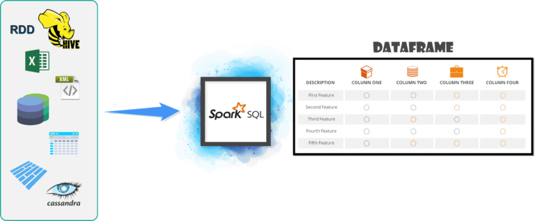

<div align="justify">

# TỔNG QUAN VỀ SPARK DATAFRAME

Theo Databricks, DataFrame là một tập hợp dữ liệu phân tán được tổ chức thành các cột được đặt tên. Về mặt khái niệm, nó tương đương với một bảng trong cơ sở dữ liệu quan hệ hoặc một khung dữ liệu trong R / Python, nhưng với các tối ưu hóa phong phú hơn. DataFrames có thể được xây dựng từ nhiều nguồn như tệp dữ liệu có cấu trúc, Hive table, cơ sở dữ liệu bên ngoài hoặc RDD hiện có.

Dataframe thường đề cập đến một cấu trúc dữ liệu, có bản chất là dạng bảng. Nó đại diện cho các Hàng, mỗi hàng bao gồm một số quan sát. Các hàng có thể có nhiều định dạng dữ liệu khác nhau (Không đồng nhất), trong khi một cột có thể có dữ liệu có cùng kiểu dữ liệu (Đồng nhất). Khung dữ liệu thường chứa một số siêu dữ liệu ngoài dữ liệu; ví dụ, tên cột và hàng.


# ĐẶC ĐIỂM DATAFRAME


* Các khung dữ liệu được phân phối trong tự nhiên, điều này làm cho nó có khả năng chịu lỗi và cấu trúc dữ liệu có sẵn cao.
* Đánh giá lười biếng là một chiến lược đánh giá giữ việc đánh giá một biểu thức cho đến khi giá trị của nó là cần thiết. Nó tránh đánh giá lặp lại. Đánh giá lười biếng trong Spark có nghĩa là quá trình thực thi sẽ không bắt đầu cho đến khi một hành động được kích hoạt. Trong Spark, bức tranh về sự lười biếng xuất hiện khi các phép biến đổi Spark xảy ra.
* Dataframe có bản chất là Bất biến . Không thay đổi được, ý tôi là nó là một đối tượng có trạng thái không thể sửa đổi sau khi nó được tạo. Nhưng chúng ta có thể biến đổi các giá trị của nó bằng cách áp dụng một phép biến đổi nhất định , như trong RDD.

# DATAFRAME CREATION

DataFrame trong Pyspark có thể được tạo theo nhiều cách:



Dữ liệu có thể được tải vào thông qua tệp CSV, JSON, XML hoặc tệp Parquet. Nó cũng có thể được tạo bằng cách sử dụng RDD hiện có và thông qua bất kỳ cơ sở dữ liệu nào khác, như Hive Table hay Apache Cassandra . Nó cũng có thể lấy dữ liệu từ HDFS hoặc hệ thống tệp cục bộ.

## sử dụng *createDataFrame()*

Bằng cách sử dụng createDataFrame()chức năng của SparkSession, bạn có thể tạo một DataFrame:

```python
import pyspark
from pyspark import SparkConf, SparkContext
from pyspark.sql import SparkSession
import collections
spark = SparkSession.builder.master("local[2]").appName("dataframetest").getOrCreate()
data = [('51800574','Loi','Tan','Huynh','2000-02-26','M',3320),
  ('51800544','Minh','Nhat','Pham','2000-05-19','M',1000),
  ('51800302','Linh','Nhat','Nguyen','2000-09-05','M',4000),
  ('51800112','Nam','Van','Ho','2000-04-01','M',2200),
  ('51800115','Thong','Huy','Luu','2000-07-17','M',3480)
]

columns = ["id","firstname","middlename","lastname","birth","gender","salary"]
df = spark.createDataFrame(data=data, schema = columns)
# df.show() hiển thị 20 phần tử đầu
df.show()
```

```note
+--------+---------+----------+--------+----------+------+------+
|      id|firstname|middlename|lastname|     birth|gender|salary|
+--------+---------+----------+--------+----------+------+------+
|51800574|      Loi|       Tan|   Huynh|2000-02-26|     M|  3320|
|51800544|     Minh|      Nhat|    Pham|2000-05-19|     M|  1000|
|51800302|     Linh|      Nhat|  Nguyen|2000-09-05|     M|  4000|
|51800112|      Nam|       Van|      Ho|2000-04-01|     M|  2200|
|51800115|    Thong|       Huy|     Luu|2000-07-17|     M|  3480|
+--------+---------+----------+--------+----------+------+------+
```

## DataFrame Operations

Giống như RDD, DataFrame cũng có các hoạt động như Biến đổi (DataFrame Transformations) và Hành động (DataFrame Actions).

## DataFrame từ nguồn dữ liệu bên ngoài

Ví dụ:

```python
import pyspark
from pyspark import SparkConf, SparkContext
from pyspark.sql import SparkSession
from google.colab import drive
drive.mount('/content/drive', force_remount=True)
import collections
spark = SparkSession.builder.master("local[2]").appName("dataframetest").getOrCreate()
df = spark.read.csv("drive/MyDrive/BIGDATA/Week2/DataFrame/DataAnalyst.csv")
df.printSchema()
```

## Các định dạng tệp được hỗ trợ

DataFrame có một bộ API phong phú hỗ trợ đọc và ghi một số định dạng tệp như:

* csv
* text
* Avro
* Parquet
* tsv
* xml và nhiều hơn nữa,...

# VÍ DỤ CỤ THỂ VIỆC SỬ DỤNG DATAFRAME LOAD DATA TỪ 1 FILE CSV

## Đọc dữ liệu từ tệp CSV

Link file dataset: https://www.kaggle.com/hverified/web-scraped-data-of-fifa-world-cup-2018-players

```python
import pyspark
from pyspark import SparkConf, SparkContext
from pyspark.sql import SparkSession
from google.colab import drive
drive.mount('/content/drive', force_remount=True)
import collections
spark = SparkSession.builder.master("local[2]").appName("dataframetest").getOrCreate()
df = spark.read.csv("drive/MyDrive/BIGDATA/Week2/DataFrame/Fifa_players.csv", inferSchema = True, header = True)
df.show()
```
result:
```note
Mounted at /content/drive
+---+---+-------+----------+------------------+-------------------+-------------------+----------+
|_c0|Age|Country|Height(cm)|International Caps|International Goals|               Name|      Role|
+---+---+-------+----------+------------------+-------------------+-------------------+----------+
|  0| 29|   Peru|  189.0 cm|                42|                  0|      Pedro GALLESE|Goalkeeper|
|  1| 34|   Peru|  179.0 cm|                75|                  0|  Alberto RODRIGUEZ|  Defender|
|  2| 29|   Peru|  172.0 cm|                24|                  0|         Aldo CORZO|  Defender|
|  3| 27|   Peru|  185.0 cm|                 8|                  0|Anderson SANTAMARIA|  Defender|
|  4| 24|   Peru|  178.0 cm|                 8|                  0|      Miguel ARAUJO|  Defender|
|  5| 26|   Peru|  169.0 cm|                29|                  0|      Miguel TRAUCO|  Defender|
|  6| 28|   Peru|  175.0 cm|                34|                  3|      Paolo HURTADO|Midfielder|
|  7| 27|   Peru|  169.0 cm|                48|                  8|    Christian CUEVA|Midfielder|
|  8| 35|   Peru|  185.0 cm|                92|                 36|     Paolo GUERRERO|   Forward|
|  9| 34|   Peru|  178.0 cm|                86|                 25|   Jefferson FARFAN|   Forward|
| 10| 28|   Peru|  169.0 cm|                32|                  4|       Raul RUIDIAZ|   Forward|
| 11| 27|   Peru|  185.0 cm|                 6|                  0|      Carlos CACEDA|Goalkeeper|
| 12| 23|   Peru|  185.0 cm|                33|                  3|       Renato TAPIA|Midfielder|
| 13| 24|   Peru|  174.0 cm|                17|                  1|          Andy POLO|Midfielder|
| 14| 30|   Peru|  185.0 cm|                73|                  3|    Christian RAMOS|  Defender|
| 15| 24|   Peru|  179.0 cm|                 4|                  0|   Wilder CARTAGENA|Midfielder|
| 16| 29|   Peru|  178.0 cm|                68|                  0|     Luis ADVINCULA|  Defender|
| 17| 27|   Peru|  181.0 cm|                49|                  6|     Andre CARRILLO|   Forward|
| 18| 28|   Peru|  173.0 cm|                76|                  2|     Yoshimar YOTUN|Midfielder|
| 19| 24|   Peru|  170.0 cm|                32|                  9|      Edison FLORES|   Forward|
+---+---+-------+----------+------------------+-------------------+-------------------+----------+
only showing top 20 rows
```
Để có một cái nhìn vào lược đồ tức là cấu trúc của DataFrame, ta sẽ sử dụng phương thức **printSchema** . Điều này sẽ cung cấp cho ta các cột khác nhau trong khung dữ liệu của chúng tôi cùng với kiểu dữ liệu và điều kiện có thể null cho cột cụ thể đó:

```python
fifa_df.printSchema()
```
result:
```note
root
 |-- _c0: integer (nullable = true)
 |-- Age: integer (nullable = true)
 |-- Country: string (nullable = true)
 |-- Height(cm): string (nullable = true)
 |-- International Caps: integer (nullable = true)
 |-- International Goals: integer (nullable = true)
 |-- Name: string (nullable = true)
 |-- Role: string (nullable = true)
```

Khi chúng ta muốn xem tên và đếm số Hàng và Cột của một DataFrame cụ thể, chúng ta sử dụng các phương pháp sau:

```python
df.columns # Column Names
df.count() # Row Count
len(df.columns)
```
result:
```note
['_c0', 'Age', 'Country', 'Height(cm)', 'International Caps', 'International Goals', 'Name', 'Role']
736
8
```
# TÀI LIỆU THAM KHẢO

* https://codetudau.com/xu-ly-du-lieu-voi-spark-dataframe/index.html
* https://helpex.vn/article/huong-dan-pyspark-dataframe-gioi-thieu-ve-dataframes-5c6b21e6ae03f628d053c29e
* https://www.edureka.co/blog/pyspark-dataframe-tutorial/#what
* https://sparkbyexamples.com/pyspark-tutorial/
</div>