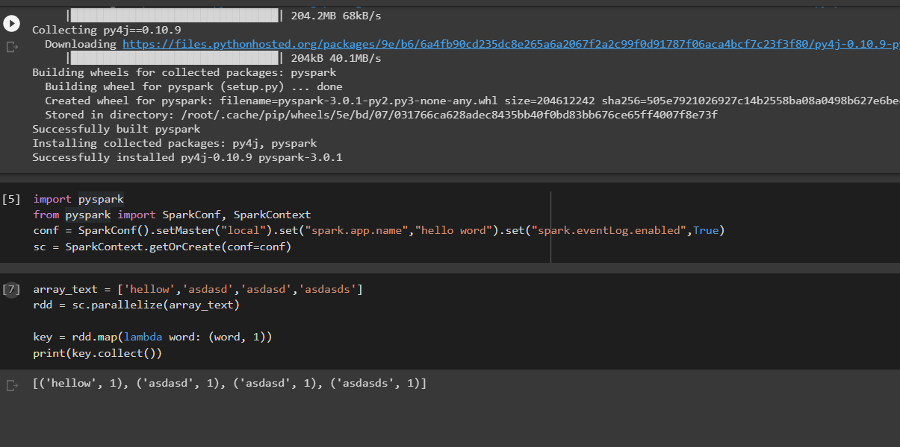

<div align="justify">

# THUỘC TÍNH SPARK *(SPARK PROPERTIES)*

Thuộc tính Spark kiểm soát hầu hết các cài đặt ứng dụng và được cấu hình riêng cho từng ứng dụng. Các thuộc tính này có thể được đặt trực tiếp trên SparkConf được chuyển đến của bạn SparkContext. SparkConf cho phép bạn định cấu hình một số thuộc tính chung (ví dụ: URL chính và tên ứng dụng), cũng như các cặp key-value tùy ý thông qua phương thức set().

Ví dụ: chúng ta có thể khởi tạo một ứng dụng với hai luồng như sau:

```python
val conf = new SparkConf()
             .setMaster("local[2]")
             .setAppName("countingWord")
val sc = new SparkContext(conf)
```

Lưu ý: với **local[2]**, nghĩa là hai luồng - thể hiện được việc tối thiểu có 2 luồng đang chạy song song, có thể giúp phát hiện lỗi chỉ tồn tại khi ta chạy trong bối cảnh phân tán.

Các thuộc tính chỉ định một số khoảng thời gian với một đơn vị thời gian. Các định dạng sau được chấp nhận trong Spark:

```note
25ms (milliseconds)
5s (seconds)
10m or 10min (minutes)
3h (hours)
5d (days)
1y (years)
```
# XEM THUỘC TÍNH CỦA SPARK *(VIEWING SPARK PROPERTIES)*

Apache spark cung cấp một bộ giao diện người dùng web tại địa chỉ http://localhost:4040 (Jobs, Stages, Tasks, Storage, Environment, Executors, and SQL). Vào thẻ Environment để xem danh sách các thuộc tính của Spark:


Ngoài ra có thể xác định giá trị mặc định thông qua spark-defaults.conf, SparkConf. Đối với các thuộc tính cấu hình khác, giá trị mặc định sẽ được áp dụng.

## Thuộc tính mặc định có sẳn

Hầu hết các thuộc tính đều có giá trị mặc định hợp lý. Một số thuộc tính như:

### Thuộc tính ứng dụng *(Application Properties)*

Ví dụ:

spark.app.name - Tên ứng dụng của bạn, được hiển thị trong giao diện người dùng và trong dữ liệu nhật ký.


Ngoài ra còn nhiều thuộc tính khác như:

* spark.driver.cores: Số lõi để sử dụng cho quy trình trình điều khiển, chỉ ở chế độ cụm.
* spark.logConf: Ghi lại SparkConf hiệu quả dưới dạng thông tin khi một SparkContext được khởi động.
* spark.driver.memoryOverhead: Số lượng bộ nhớ không phải bộ nhớ heap sẽ được phân bổ cho mỗi quá trình điều khiển ở chế độ cụm.
* spark.resources.discoveryPlugin, ...

### Thuộc tính xáo trộn *(Shuffle Behavior)*

Một vài thuộc tính như:

* spark.shuffle.compress: Có nén các map output file hay không.
* spark.shuffle.io.retryWait: (Chỉ mạng) Thời gian chờ giữa các lần tìm nạp lại. Theo mặc định, Độ trễ tối đa do thử lại là 15 giây.
* spark.shuffle.service.port: Cổng mà dịch vụ shuffle ngoài sẽ chạy, mặc định port 7337.
* spark.shuffle.compress, ...

### Giao diện người dùng Spark *(Spark UI)*

Ví dụ:

spark.eventLog.enabled - Có ghi lại các sự kiện Spark hay không, hữu ích trong việc tạo lại giao diện người dùng Web sau khi ứng dụng hoàn tất.



Một vài thuộc tính khác:

* spark.eventLog.logBlockUpdates.enabled: Có ghi lại các sự kiện cho mỗi lần cập nhật khối hay không, nếu spark.eventLog.enabled là true => *Cảnh báo*: Điều này sẽ làm tăng đáng kể kích thước của nhật ký sự kiện.
* spark.eventLog.compress: Có nén các sự kiện đã ghi nếu spark.eventLog.enabled = true.
* spark.eventLog.overwrite: Có ghi đè lên bất kỳ tệp hiện có nào không.
* spark.ui.enabled: Có chạy giao diện người dùng web (User interface) cho ứng dụng Spark hay không.

### Nén và tuần tự hoá *(Compression and Serialization)*

spark.rdd.compress - Có nén các phân vùng tuần tự

Ví dụ:
StorageLevel.MEMORY_ONLY_SERtrong Java và Scala hoặc StorageLevel.MEMORY_ONLY trong Python). Có thể tiết kiệm không gian đáng kể với chi phí tăng thêm thời gian CPU. Nén sẽ sử dụng tới thuộc tính spark.io.compression.codec.

Các thuộc tính khác:

* spark.serializer
* spark.serializer.objectStreamReset
* spark.kryoserializer.buffer
* spark.kryo.registrator
* spark.kryo.referenceTracking, ...

### 

</div>